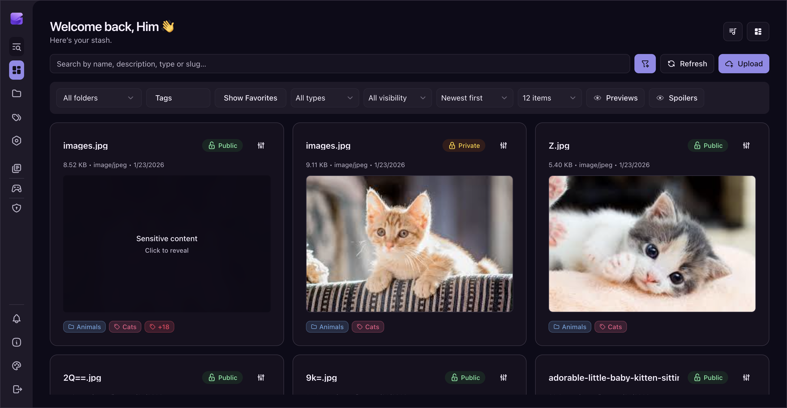
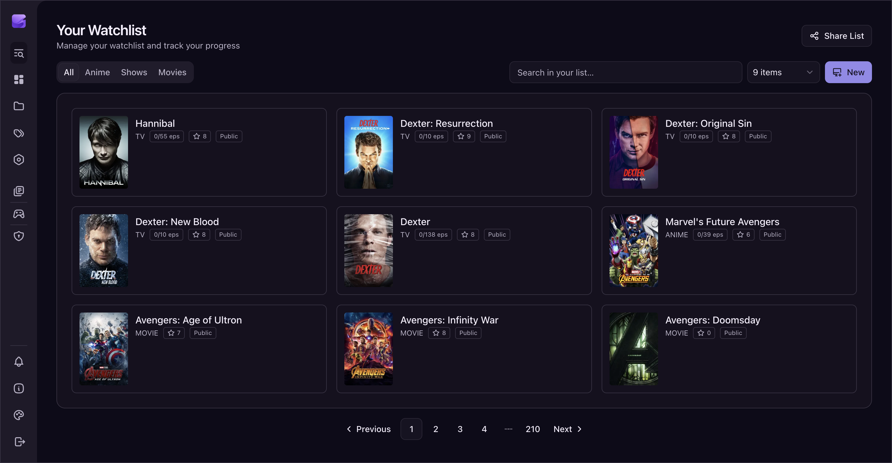
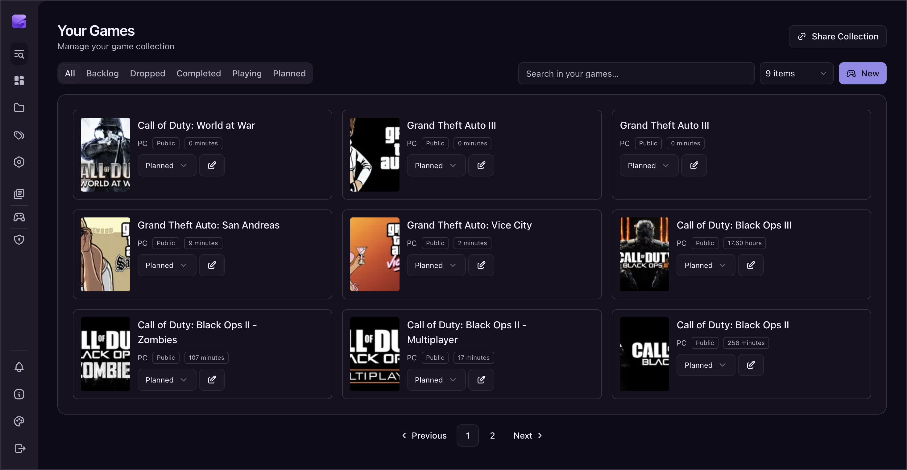
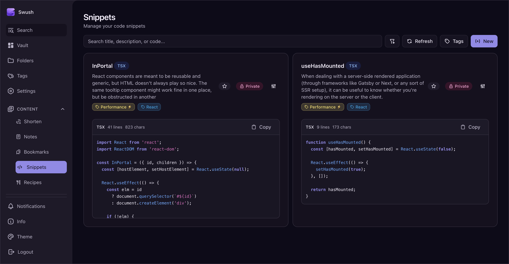

# Swush

Swush is a secure, self-hosted full‑stack file manager and personal dashboard built with Next.js, TypeScript, TailwindCSS, and Better Auth. It offers a unified platform to manage your bookmarks, notes, snippets, recipes, watchlist (anime, movies, TV shows), games collection, and more; all with privacy and control in mind.


## ✨ Features

### Authentication & Security
- Better Auth sessions with optional 2FA (TOTP).
- Robust session management and role-based access.
- Role-based access control with Owner, Admin, and User roles.
- Admin capabilities to promote/demote users and protect API endpoints.

### Content Management Modules
- Files, Short Links, Bookmarks*, Snippets*, Recipes*, Notes*, Upload Requests.
- Pagination, bulk selection and deletion.
- Slug support for friendly URLs.

### Sharing & Growth
- Public profiles and share pages with optional passwords.
- QR sharing with presets and avatar overlays.
- UTM builder for short links.

### Watchlist
- Track movies, TV shows, and anime via TMDB & AniList integrations. (Integrations are solely per the session, no user data is saved, but the selected data is retained.)
- Season and episode progress tracking.
- Adding personal notes.
- Bulk actions (delete, change visibility).
- Public sharing via `/l/username` with optional privacy toggle for each show.
- Import data from AniList.

### Games Collection*
- Add games manually or import from Steam.
- Track status: playing, completed, backlog, dropped.
- Bulk actions and pagination.
- Adding personal notes.
- Public sharing via `/g/username` with optional privacy toggle for each game.

### UI/UX
- Responsive design powered by Tailwind CSS v4.
- Smooth animations and transitions.
- Image paste-to-upload functionality.

### Infrastructure & Integrations
- Minimal API routes abstracted into reusable `lib/` functions.
- Email notifications for password resets, new logins, and import summaries.
- Docker support for streamlined production deployment.


## 📦 Tech Stack
- **Frontend:** Next.js, React, TailwindCSS
- **Backend:** Next.js API routes, TypeScript, Better Auth (authentication)
- **Database:** PostgreSQL (Neon or self-hosted)
- **ORM:** Drizzle
- **External APIs:** TMDB, AniList, Steam, RAWG
- **Email:** SMTP (configurable)


## 🚀 Getting Started

### 1. Clone the repository
```bash
bun x degit imthatdev/swush-ce
cd swush
```

### 2. Install dependencies
```bash
bun install
```

### 3. Setup environment variables
Copy `example.env` to `.env` and update the values:
```bash
cp example.env .env
```

### 4. Environment Variables Overview

#### Core
- Please consider checking the `.env` file for all available options. Commented variables have default values or optional.

### 5. Run database migrations
```bash
bun x drizzle-kit push
```

### 6. Start the development server
```bash
bun dev
```

Open [http://localhost:3000](http://localhost:3000) in your browser.


## 🐳 Deployment with Docker

### Build and run with remote database (Neon, Supabase, etc.)
```bash
docker compose up -d --build
```

### Run with self-hosted PostgreSQL
```bash
docker compose -f docker-compose.yml -f docker-compose.postgres.yml up -d --build
```

- The app will be accessible at [http://localhost:3000](http://localhost:3000).
- PostgreSQL will be exposed on port `5432` (credentials configured in `.env`).

## ⏱️ Scheduled Jobs (Cron)

The job endpoints are secured by `CRON_SECRET` and must be called by a scheduler.
By default, the app runs jobs internally (single instance only) using the
`cron` npm package with the schedule set to 03:00 UTC+3 (midnight UTC). To
disable, set `ENABLE_APP_CRON=false`. Do not enable this when running multiple
app replicas or the jobs will run multiple times.

Vercel example config is in `vercel.example.json` (Vercel cron runs in UTC).
Note: Vercel cron does not send custom headers, so you will need a proxy that
adds `x-cron-secret` or relax the header check for Vercel-only deployments.

## ☁️ Cloudflare Cache Rules (HLS Only)

If you use Cloudflare Tunnels (cloudflared) and a **global “Bypass Cache”** rule,
you can still safely cache HLS streaming assets only. This improves playback
startup and reduces origin load while leaving everything else uncached.

**Recommended rule (Cache Everything only for HLS):**

**Expression**
```
(http.host eq "sub.example.domain" and starts_with(http.request.uri.path, "/hls/"))
```
**Settings**
- Cache: **Cache Everything**
- Origin Cache Control: **On** (respect origin headers)
- Edge Cache TTL: **Use Cache-Control header**

This keeps:
- `.m3u8` playlists short‑lived (origin sends short cache)
- `.ts/.m4s/.aac` segments long‑lived (origin sends immutable cache)

If you want to keep your global bypass rule, just add this HLS rule **above it**
so `/hls/*` is cached while all other routes stay bypassed.


## 🍎 Apple Shortcuts (API Automation)

You can automate Swush actions from iOS/macOS Shortcuts using **Get Contents of URL**.
All requests require your API key as `x-api-key`.

### Bookmark Shortcut
**Request**
- Method: `POST`
- URL: `https://your-domain.com/api/v1/bookmarks`
- Headers:
  - `Content-Type: application/json`
  - `x-api-key: YOUR_KEY`
- Body (JSON):
```
{
  "url": "https://example.com",
  "title": "Optional title",
  "isPublic": false,
  "tags": ["reading", "ideas"]
}
```

### Short Link Shortcut
**Request**
- Method: `POST`
- URL: `https://your-domain.com/api/v1/shorten`
- Headers:
  - `Content-Type: application/json`
  - `x-api-key: YOUR_KEY`
- Body (JSON):
```
{
  "originalUrl": "https://example.com",
  "isPublic": true
}
```

### Note Shortcut
**Request**
- Method: `POST`
- URL: `https://your-domain.com/api/v1/notes`
- Headers:
  - `Content-Type: application/json`
  - `x-api-key: YOUR_KEY`
- Body (JSON):
```
{
  "title": "Optional title",
  "content": "note text",
  "sourceUrl": "https://source.com",
  "isPublic": false,
  "tags": ["ideas"]
}
```

### File Upload Shortcut
Use Shortcuts with a **Form** body and attach a file.

**Request**
- Method: `POST`
- URL: `https://your-domain.com/api/v1/upload`
- Headers:
  - `x-api-key: YOUR_KEY`
- Body (Form):
  - `file`: (the selected file)
  - `isPublic`: `true` or `false`
  - `description`: `Optional description`
  - `folderName`: `Optional folder name`
  - `newTags`: `tag1,tag2,tag3`

## 🔧 Self‑Hosting Guide

1. **DNS & Reverse Proxy**
   - Point your domain to your server's IP.
   - Use a reverse proxy like Nginx, Traefik, or Caddy with HTTPS enabled (Let's Encrypt recommended).

2. **Environment Variables**
   - Set `APP_URL` to your domain with HTTPS.
   - Securely configure `BETTER_AUTH_SECRET` and database credentials.

3. **Database**
   - Choose Neon (managed) or self-hosted PostgreSQL.
   - Regularly back up your database.

4. **Email**
   - Configure SMTP settings for password resets and notifications.


## 📸 Screenshots










## 🌐 Demo

Experience Swush live at [demo.swush.app](https://demo.swush.app).

You can sign up and test all features with your account, if the demo is online and if the registration is open. (You may contact me if it's closed.)

Feel free to explore the features and get a feel for the app before deploying your own instance.


## 🤝 Contributing

Contributions are welcome! To contribute:

- Fork the repository.
- Create a feature branch.
- Open a pull request.

Before committing, run linting and tests:

```bash
bun lint
```


## 📜 License

APACHE 2.0 © 2026 Iconical


## 💬 Support

- X: [x.com/imthatdevy](https://x.com/imthatdevy)
- Website: [iconical.dev](https://iconical.dev)
- GitHub: [imthatdev](https://github.com/imthatdev)
- Email: him@iconical.dev

## 🙏 To Note

\* Bookmarks, Snippets, Recipes, and Notes are Pro edition features and not available in the Community Edition (CE).